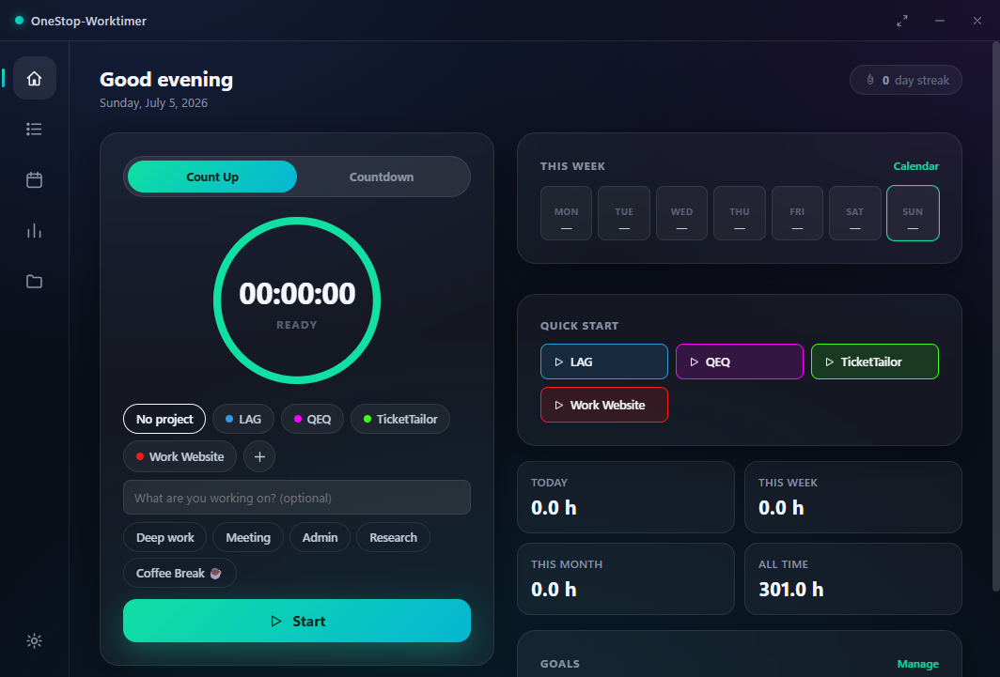
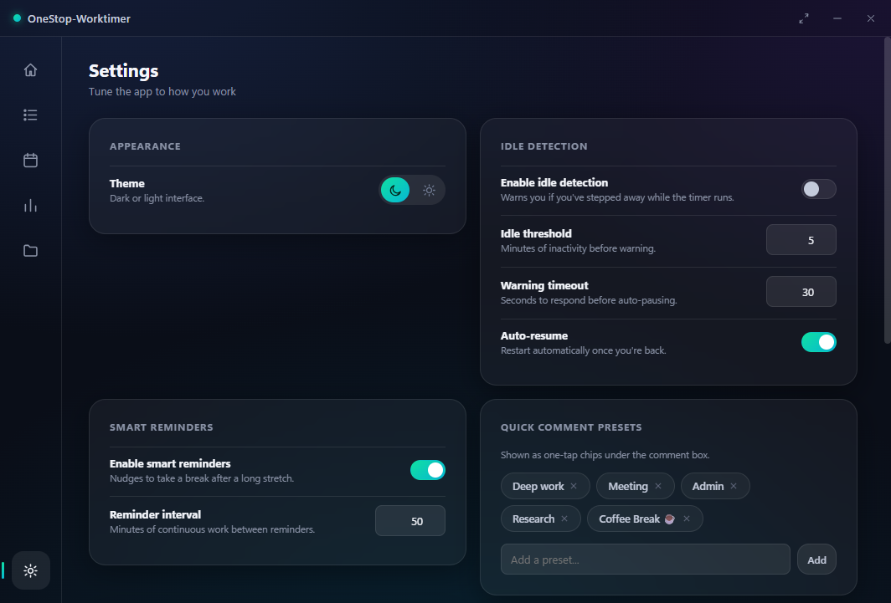

# OneStop-Worktimer

Offline desktop timer for tracking work sessions. Projects, analytics, calendar, goals, and exports — all stored locally in SQLite. No account, no cloud, no telemetry.



## Highlights

- **Timer** — count-up or countdown, animated ring, project tags, quick comments, global hotkey (`Ctrl+Alt+S`)
- **Dashboard** — week-at-a-glance strip, KPIs, goals, streaks, one-tap project start
- **History** — search, filter, edit, delete; export to CSV or Excel
- **Calendar** — month grid tinted by project color; multi-project days split proportionally
- **Analytics** — hours over time, project breakdown, time-of-day and weekday charts, activity heatmap
- **Data** — automatic rotating backups, manual backup/restore, full JSON export



## Download

Grab **WorkTrackTimer.exe** from [Releases](https://github.com/F3ncheltee/onestop-worktimer/releases). No installer — place the file anywhere and run it. A `worktrack.db` file is created next to the executable on first launch.

## Run from source

Requirements: **Windows 10/11**, **Python 3.10+**, **Edge WebView2** (preinstalled on current Windows).

```powershell
git clone https://github.com/F3ncheltee/onestop-worktimer.git
cd onestop-worktimer
pip install -r requirements.txt
python -m app.main
```

## Build executable

```powershell
python build_exe.py
```

Output: `dist/WorkTrackTimer.exe`. If `dist/worktrack.db` already exists, the build script preserves it across rebuilds.

## Usage

| Action | How |
|--------|-----|
| Start / stop | Dashboard **Start** button or `Ctrl+Alt+S` |
| Quick actions | `Ctrl+K` command palette |
| Compact timer | Title bar compact button (always on top) |
| Minimize | Close button sends app to system tray |
| Backups | **Settings → Data & backup** |

## Data

Sessions and projects live in `worktrack.db` beside the app. Schema updates are additive only (versioned migrations). Startup creates a timestamped backup in `backups/` when migrations run.

## Stack

Python · pywebview (WebView2) · SQLite · Chart.js · pystray · pynput · PyInstaller

## License

**Personal use is free.** You may use OneStop-Worktimer for private, non-commercial purposes at no charge.

**Commercial use requires a paid license.** This includes use by companies, organizations, freelancers tracking client work, or any business-related time tracking. See [LICENSE](LICENSE) for full terms.

To purchase a commercial license, open an issue or contact the maintainer via GitHub.
